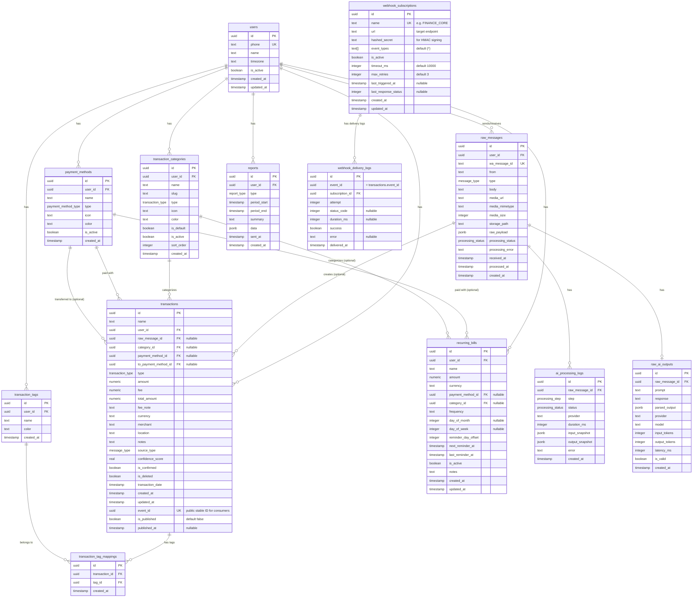

# FinCore Database Schema

This document outlines the database schema for the FinCore project, which uses Drizzle ORM and PostgreSQL. The schema reflects the definitions found in the `0000_aromatic_mathemanic.sql` migration and the `0001_event_publishing.sql` migration.

## Entity-Relationship Diagram (ERD)

The following Mermaid diagram provides a visual representation of the tables and their relationships:



## Enum Definitions

- **`message_type`**: `text`, `voice`, `image`, `document`, `video`
- **`payment_method_type`**: `cash`, `e_wallet`, `bank_transfer`, `credit_card`, `debit_card`, `qris`, `other`
- **`processing_status`**: `pending`, `processing`, `done`, `failed`, `skipped`
- **`processing_step`**: `transcription`, `ocr`, `ai_extraction`, `categorization`, `notification`
- **`report_type`**: `daily`, `weekly`, `monthly`, `custom`
- **`transaction_type`**: `expense`, `income`, `transfer`

## Key Table Details

### Users

Central entity tracking the users of the FinCore application (identified uniquely by their `phone` number).

### Core Financials

- **`transactions`**: The core table for logging any monetary movement (income, expense, transfer). Supports soft deletions and confirmation flags for AI-generated entries.
  - `event_id` — public-facing stable UUID for external consumers (Finance Core, etc.). Different from internal `id` PK. Consumers store this for idempotency.
  - `is_published` / `published_at` — tracks whether the event has been delivered to at least one webhook subscriber.
- **`transaction_categories` & `transaction_tags`**: Allow grouping, tagging, and categorizing transactions. Many-to-many relationship for tags is handled by `transaction_tag_mappings`.
- **`payment_methods`**: Source (and target, for transfers) for financial transactions.
- **`recurring_bills`**: Tracks scheduled financial commitments. Includes detailed timing logic (frequency, day of month, week).

### Messaging & AI Pipeline

- **`raw_messages`**: Initial log of incoming (e.g., from WhatsApp) payloads. Holds attachments, text, or voice paths. Tracks the overarching processing state.
- **`raw_ai_outputs`**: Directly connected to the AI providers processing the message. Logs prompt, response, tokens, and latency to measure accuracy and cost.
- **`ai_processing_logs`**: Step-by-step audit trail for each stage (`transcription`, `ocr`, `ai_extraction`, etc.) applied to a raw message, storing intermediate snapshots of inputs/outputs.

### Event Publishing (Multi-Webhook)

- **`webhook_subscriptions`**: Source of truth for all webhook subscribers. DB-managed; env vars (`FINCORE_WEBHOOK_<NAME>=url|secret|filter`) only bootstrap on startup with no-overwrite semantics.
  - `name` — unique human-readable key, used as upsert key during env bootstrap.
  - `event_types` — PostgreSQL array, `{'*'}` means subscribe to all events.
  - `last_triggered_at` / `last_response_status` — health tracking fields.
- **`webhook_delivery_logs`**: Per-subscriber per-event delivery audit log. `event_id` references `transactions.event_id` (not a FK — allows logs to persist even if transaction is soft-deleted). Useful for debugging, health monitoring, and manual re-delivery.

## Event Publishing Flow

```
Transaction saved (is_published = false)
      ↓
Enqueue: event-publishing job (QueueName.EVENT_PUBLISHING)
      ↓
EventPublisher.publish(FinancialEvent)
      ↓
WebhookRegistryService.getActiveSubscribers(eventType)
      ↓
  ┌── No active subscribers?
  │     → log debug, skip, is_published stays FALSE
  │       (catch-up job will retry when subscribers are registered)
  │
  └── N active subscribers?
        → deliver to ALL in parallel (Promise.allSettled)
        ├── Finance Core  → ✅ 200 OK → log to webhook_delivery_logs
        ├── Google Sheets → ✅ 200 OK → log to webhook_delivery_logs
        └── Custom Script → ❌ timeout → log failure, retry (BullMQ backoff)
        │
        → If ANY succeeds: mark is_published = true, publishedAt = now()
        → Log all results to webhook_delivery_logs
```
